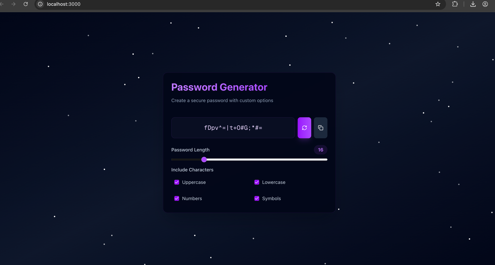

# Password Generator

A modern, secure password generator built with Next.js, TypeScript, and shadcn/ui. Features a beautiful dark cosmic theme with customizable password options.



## Running with Docker

1. Clone the repository:
```bash
git clone https://github.com/arentheme/passgen-web.git
```

2. Navigate to the project directory:
```bash
cd passgen-web
```

3. Build the Docker image:
```bash
docker build -t passgen-web .
```

4. Run the container:
```bash
docker run -d -p 3000:3000 passgen-web
```

5. Open your browser and visit:
```
http://localhost:3000
```

## Running Locally (without Docker)

1. Clone the repository:
```bash
git clone https://github.com/arentheme/passgen-web.git
cd passgen-web
```

2. Install dependencies:
```bash
npm install
```

3. Run the development server:
```bash
npm run dev
```

4. Open [http://localhost:3000](http://localhost:3000) in your browser.
